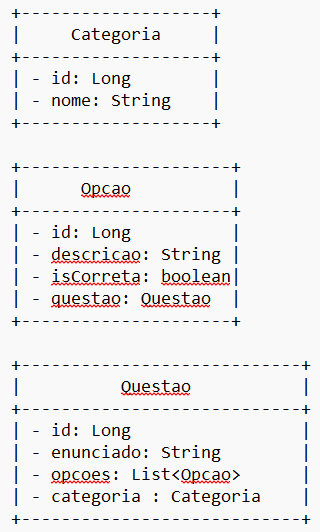

# API com Autenticação

Partindo do projeto desenvolvido em aula ([security-tutorial-api-ex](https://github.com/marcoweb/security-tutorial-api-ex)), construa os artefatos (Modelo, DTO, Serviço, Controlador) necessários para gerenciar os modelos abaixo:

